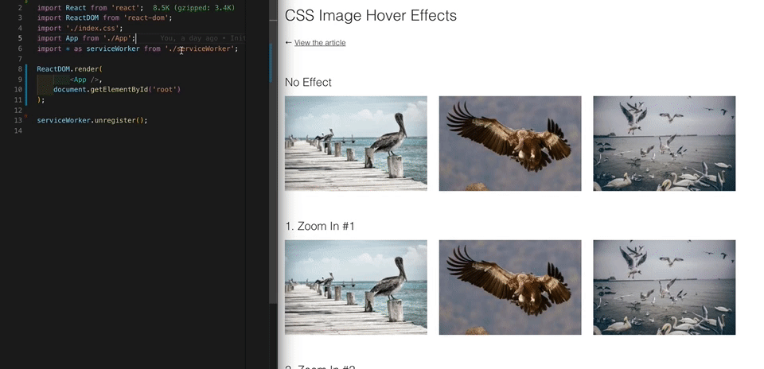

<p align="center">
  
</p>

<br />

<div align="center"><strong>Vebug</strong></div>
<div align="center">A visual component debugger packaged as a React Component.</div>

<br />
<br />

<div align="center"><strong>Easily visualize the total space of your components (including margin and padding)</strong></div>
<p align="center">
  
</p>

## 🚀 Quick start

1.  **Installation**

    ```sh
    # npm
    npm install -D vebug

    # yarn
    yarn add -D vebug
    ```

2.  **Wrap the component you want to debug**

    ```js
    <Vebug>
      <YourComponent />
    </Vebug>
    ```

<br/>

**Shortcomings**

Vebug works by overriding the CSS of its children, but will not override CSS styles defined directly on any component defined by ID.
